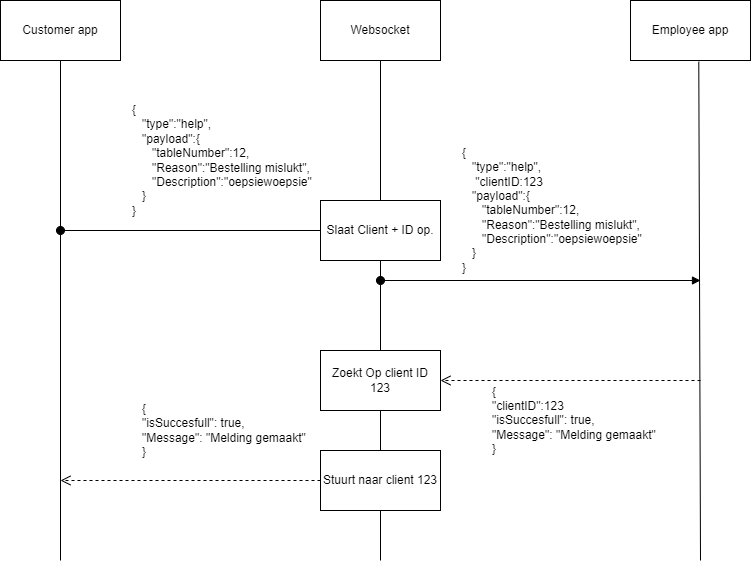

# Robot Communication
Websocket server that enables communication between two clients (app -> robot or app -> app)

## Implementation explanation
The main idea behind the communication is that the websocket acts as a vehicle that transfers information from one client to another client. The only thing that a client must do is connect to the correct endpoint. When a client sends information, the other client must parse this information and, optionally, return the correct response.

## Endpoints
| Endpoint  | Client       |
|-----------|--------------|
| /robot    | app -> robot |
| /customer | app -> app   |

## Sending data
**/robot** 
This websocket has absolutely 0 code to enforce any message structure. You can just send strings of text between the clients.

**/customer** 
The most important thing here is that all of the data that is being sent is written as a JSON object. When one client sends a message the socket will append a clientID to that one message. This ID is unique per message. Another client may respond to that message by appending that ID to their own message. This will make the socket send the response message to the client that made the initial message.

 
*Example of the flow of the customer socket*
